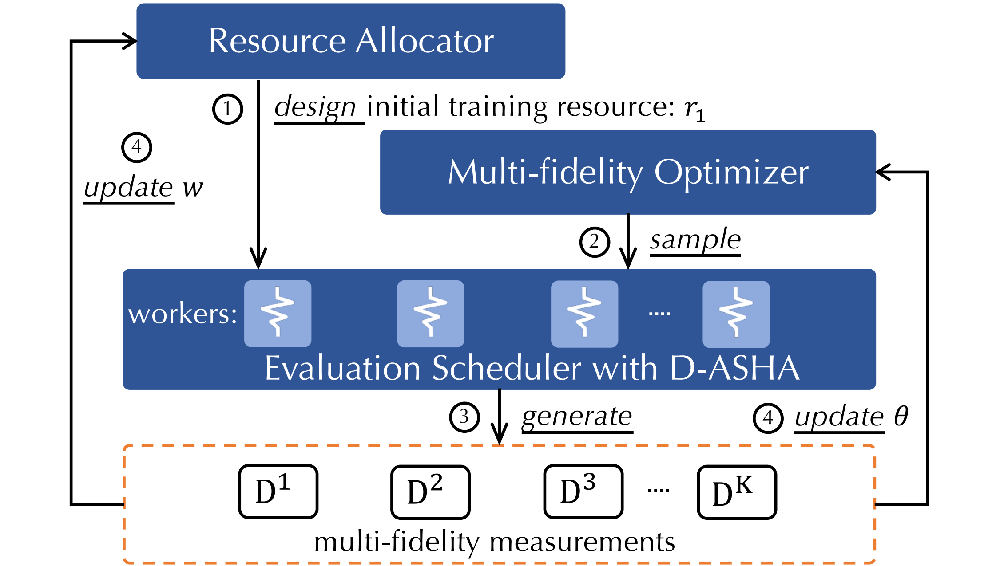

<p align="center">

</p>

-----------

[](https://github.com/thomas-young-2013/HyperTune/blob/master/LICENSE)
[](https://api.travis-ci.org/thomas-young-2013)
[](https://github.com/thomas-young-2013/HyperTune/issues?q=is%3Aissue+is%3Aopen)
[](https://github.com/thomas-young-2013/HyperTune/issues?q=is%3Aissue+is%3Aopen+label%3Abug)
[](https://github.com/thomas-young-2013/HyperTune/pulls?q=is%3Apr+is%3Aopen)
[](https://github.com/thomas-young-2013/HyperTune/releases)
[](https://gitter.im/HyperTune?utm_source=badge&utm_medium=badge&utm_campaign=pr-badge&utm_content=badge)
[](https://HyperTune.readthedocs.io/en/latest/?badge=latest)

## HyperTune: an Efficient Blackbox Optimization System at Scale
**HyperTune** is an scalable and efficient system for distributed blackbox optimization, particularly hyper-parameter tuning. It is designed and developed by the AutoML team from the <a href="http://net.pku.edu.cn/~cuibin/" target="_blank" rel="nofollow">DAIR Lab</a> at Peking University. The designing goal is to make blackbox optimization easier to be applied in both academia and industry, and help facilitate data science.


## Links
+ Documentations: [to appear soon]()
+ Examples: [to appear soon]()
+ Conda package: [to appear soon]()
+ Blog post: [to appear soon]()


## HyperTune Framework in a Glance
<p align="center">

</p>

HyperTune contains the following three functionality components:
+ **Resource Allocator**: The resource allocator aims to find the optimal bracket (i.e., initial resource) for new configurations that minimizes the evaluation costs while keeping a high precision.
+ **Evaluation Scheduler**: The evaluation scheduler determines which configuration to promote (i.e., evaluate with larger resources) to ensure fast convergence and high sample efficiency.
+ **Multi-fidelity Optimizer**: The multi-fidelity optimizer suggests the next configuration to evaluate based on the results of previous partial evaluations.

For more details of HyperTune, please refer to our paper [to appear soon]().
## Installation

### System Requirements

Installation Requirements:
+ Python >= 3.6 (Python 3.7 is recommended!)

Supported Systems:
+ Linux (Ubuntu, ...)
+ macOS
+ Windows

We **strongly** suggest you to create a Python environment via [Anaconda](https://www.anaconda.com/products/individual#Downloads):
```bash
conda create -n hypertune3.7 python=3.7
conda activate hypertune3.7
```

Then update your `pip` and `setuptools` as follows:
```bash
pip install pip setuptools --upgrade
```

### Manual Installation from Source

To install the newest HyperTune package, just type the following scripts on the command line:

```bash
git clone https://github.com/thomas-young-2013/HyperTune.git && cd HyperTune
cat requirements/main.txt | xargs -n 1 -L 1 pip install
python setup.py install --user
```

For more details about installation instructions, please refer to the Installation Guide Document [To appear soon]().

## Quick Start

A quick start example is as follows:

First, define a configuration space and objective function. The objective function which takes an configuration and the resource ratio as inputs.
Here, we take the counting-one problem as an example.

```python
import numpy as np
from ConfigSpace import ConfigurationSpace, CategoricalHyperparameter, UniformFloatHyperparameter
n_cat = 32
n_cont = 32
cs = ConfigurationSpace()
for i in range(n_cat):
    var_cat = CategoricalHyperparameter("cat%d" % i, choices=[0, 1])
    cs.add_hyperparameter(var_cat)
for i in range(n_cont):
    var_cont = UniformFloatHyperparameter("cont%d" % i, 0, 1)
    cs.add_hyperparameter(var_cont)

def objective_function(config, resource_ratio):
    max_samples = 729
    rng = np.random.RandomState(42)
    x_cat = [config['cat%d' % i] for i in range(n_cat)]
    x_cont = [config['cont%d' % i] for i in range(n_cont)]

    result = -np.sum(x_cat)
    # draw samples to approximate the expectation (Bernoulli distribution)
    n_samples = int(max_samples * resource_ratio)
    for x in x_cont:
        result -= rng.binomial(n_samples, p=x) / n_samples
    return result # The lower, the better
```

Then, start a master to suggest configurations:

```python
from tuner.async_mq_mfes import async_mqMFES
master_ip = 'xxx.xxx.xxx.xxx'
master_port = 'xx'
authkey = 'xxx'
master = async_mqMFES(
    objective_function, cs, R=81, random_state=1,
    restart_needed=True, runtime_limit=300,
    ip=master_ip, port=master_port, authkey=authkey,
)
master.run()
```

Finally, start workers to evaluate configurations from the master:

```python
from tuner.async_mq_mf_worker import async_mqmfWorker as Worker
worker = Worker(objective_function, master_ip, master_port, authkey=authkey)
worker.run()
```

**More Examples**:
+ [To appear soon]()

## **Enterprise Users**
<p align="left">

</p>

* [Kuaishou Technology](https://www.kuaishou.com/en)

## **Releases and Contributing**
HyperTune has a frequent release cycle. Please let us know if you encounter a bug by [filling an issue](https://github.com/thomas-young-2013/HyperTune/issues/new/choose).

We appreciate all contributions. If you are planning to contribute any bug-fixes, please do so without further discussions.

If you plan to contribute new features, new modules, etc. please first open an issue or reuse an existing issue, and discuss the feature with us.

To learn more about making a contribution to HyperTune, please refer to our [How-to contribution page](https://github.com/thomas-young-2013/HyperTune/blob/master/CONTRIBUTING.md). 

We appreciate all contributions and thank all the contributors!


## **Feedback**
* [File an issue](https://github.com/thomas-young-2013/HyperTune/issues) on GitHub.
* Email us via *liyang.cs@pku.edu.cn*.


## Related Projects

Targeting at openness and advancing AutoML ecosystems, we had also released few other open source projects.

* [MindWare](https://github.com/PKU-DAIR/mindware): an open source system that provides end-to-end ML model training and inference capabilities.

* [OpenBox](https://github.com/PKU-DAIR/open-box): an open source system and service to efficiently solve generalized blackbox optimization problems.

---------------------
## **Related Publications**
**Hyper-Tune: Towards Efficient Hyper-parameter Tuning at Scale**
Yang Li, Yu Shen, Huaijun Jiang, Wetao Zhang, Jixiang Li, Ji Liu, Ce Zhang, Bin Cui
To appear soon

**OpenBox: A Generalized Black-box Optimization Service**
Yang Li, Yu Shen, Wentao Zhang, Yuanwei Chen, Huaijun Jiang, Mingchao Liu, Jiawei Jiang, Jinyang Gao, Wentao Wu, Zhi Yang, Ce Zhang, Bin Cui; ACM SIGKDD Conference on Knowledge Discovery and Data Mining (KDD 2021).
https://arxiv.org/abs/2106.00421

**MFES-HB: Efficient Hyperband with Multi-Fidelity Quality Measurements**
Yang Li, Yu Shen, Jiawei Jiang, Jinyang Gao, Ce Zhang, Bin Cui; The Thirty-Fifth AAAI Conference on Artificial Intelligence (AAAI 2021).
https://arxiv.org/abs/2012.03011

## **License**

The entire codebase is under [MIT license](LICENSE).